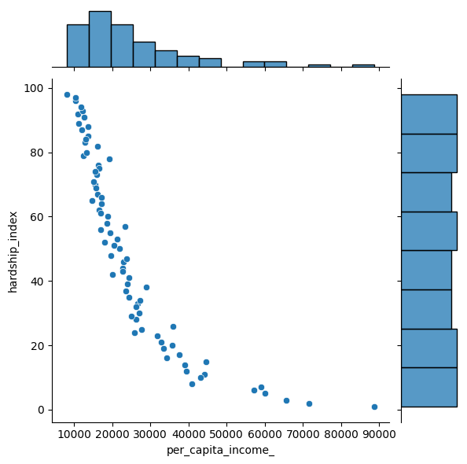

# Analyzing-Socioeconomic-Indicators-in-Chicago-with-SQL-Python-and-Power-BI

### Overview
This project involves analyzing a real-world dataset containing selected socioeconomic indicators in Chicago using SQL, Python and Power Bi. The dataset, sourced from the Chicago City Portal, includes critical socioeconomic indicators and a hardship index for various community areas in Chicago from 2008 to 2012. The objective is to perform basic analysis and gain insights using SQL and Python.

### Objectives

After this task, i should be able to answer the following questions:

- How many community areas in Chicago have a hardship index greater than 50.0
- What is the maximum value of hardship index in this dataset?
- Which community area which has the highest hardship index?
- Which Chicago community areas have per-capita incomes greater than $60,000?
- Create a scatter plot using the variables per_capita_income_ and hardship_index. Explain the correlation between the two variables.

### Dataset Description

The dataset comprises several socioeconomic indicators for each community area in Chicago. These include:

- Community Area Number (ca): Used to uniquely identify each row of the dataset
- Community Area Name (community_area_name): The name of the region in the city of Chicago
- Percent of Housing Crowded (percent_of_housing_crowded): Percent of occupied housing units with more than one person per room
- Percent Households Below Poverty (percent_households_below_poverty): Percent of households living below the federal poverty line
- Percent Aged 16+ Unemployed (percent_aged_16_unemployed): Percent of persons over the age of 16 years that are unemployed
- Percent Aged 25+ without High School Diploma (percent_aged_25_without_high_school_diploma): Percent of persons over the age of 25 years without a high school education
- Percent Aged Under 18 or Over 64:Percent of population under 18 or over 64 years of age (percent_aged_under_18_or_over_64): (ie. dependents)
- Per Capita Income (per_capita_income_): Community Area per capita income is estimated as the sum of tract-level aggragate incomes divided by the total population
- Hardship Index (hardship_index): Score that incorporates each of the six selected socioeconomic indicators
- The hardship index ranges from 1 to 100, indicating the level of hardship, with higher scores representing greater hardship.

For a detailed dataset description, refer to the [City of Chicago's website](https://data.cityofchicago.org/Health-Human-Services/Census-Data-Selected-socioeconomic-indicators-in-C/kn9c-c2s2?utm_medium=Exinfluencer&utm_source=Exinfluencer&utm_content=000026UJ&utm_term=10006555&utm_id=NA-SkillsNetwork-Channel-SkillsNetworkCoursesIBMDeveloperSkillsNetworkDB0201ENSkillsNetwork20127838-2021-01-01).

**Database Connection**: Establishing a connection to the dataset stored in an SQLite database.

**Basic Analysis with Python**: Exploring and analyzing the variables and socioeconomic indicators using Python.

***Data integrity has been checked and data is clean***

### Analysis & Findings

How many community areas in Chicago have a hardship index greater than 50.0

What is the maximum value of hardship index in this dataset?

Which community area which has the highest hardship index?

Which Chicago community areas have per-capita incomes greater than $60,000?

Create a scatter plot using the variables per_capita_income_ and hardship_index. Explain the correlation between the two variables.

#### Power BI Dashboard

### Conclusion

**Explain the correlation between per_capita_income_ and hardship_index** :
As per capita income increases, the hardship index tends to decrease, and vice versa. This makes intuitive sense, as areas with higher incomes would generally be expected to have lower levels of hardship.

